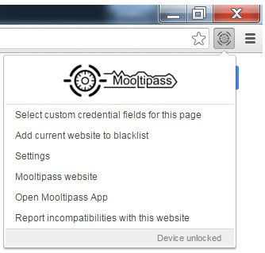

# Mooltipass Browser Extension 

This is the Mooltipass extension, which will be the interface between the websites you visit and your Mooltipass device

## Browser support

## The Mooltipass Project

With time, logins and passwords have become critical elements we need to remember to access the different websites and services we use daily. If we want to achieve good security, each of these credential sets should be unique.
We therefore created the Mooltipass, a physical password keeper that remembers and encrypts your credentials so you don't have to. With this device, you can generate and safely store long and complex passwords. A personal PIN locked smartcard allows the decryption of your credentials and ensures that only you have access to them. Simply visit a website and the device will ask for your confirmation to enter your credentials when login is required.
The Mooltipass is a standalone device connected through USB, is completely driver-less and is compatible with all major operating systems on PCs, Macs and Smartphones. [More info](https://www.themooltipass.com/)

## Usage

In Chrome, Firefox or Safari, the Mooltipass icon
may be found next to your address bar. 

Clicking on it will display a menu. 

## License
[MIT](https://choosealicense.com/licenses/mit/)